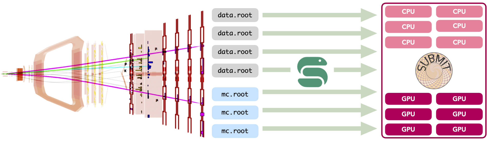
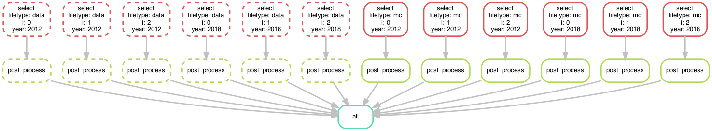
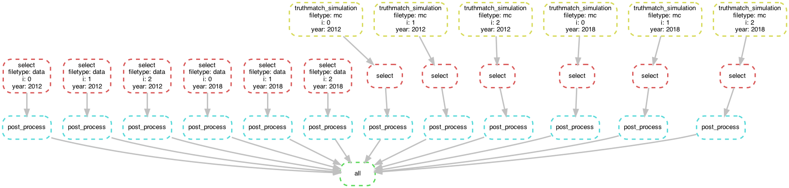
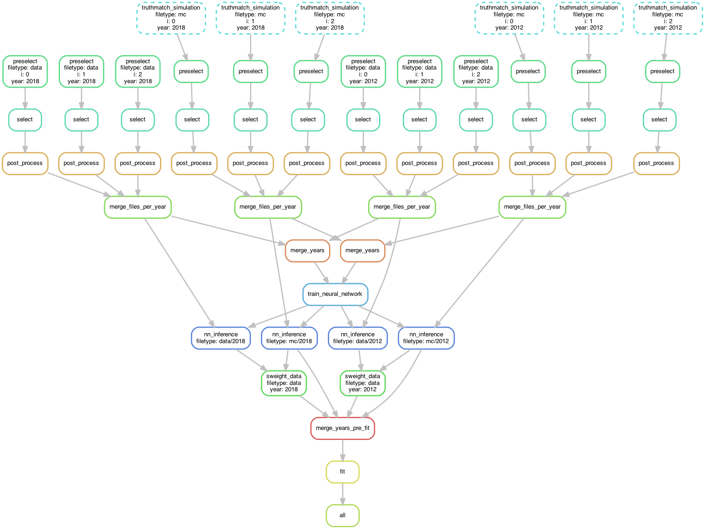

# Snakemake@subMIT for scientific discovery at LHCb



Snakemake tutorial delivered at the _Workshop on Basic Computing Services in the Physics Department - subMIT_ at MIT in January 2024. 

Disclaimer: no LHCb data has been used to generate this tutorial. 

Get in touch: `blaised at mit.edu`.

## Table of Contents

## Setup

Assuming you have a [conda](https://conda.io/projects/conda/en/latest/user-guide/install/index.html) installation in your user area:

1. **Preliminary step**: install [Mamba](https://github.com/mamba-org/mamba), essentially an accelerated version of the [Conda](https://docs.conda.io/en/latest/) package manager. 
The best thing of Mamba is that you can using `mamba` as a drop-in replacement for virtually all `conda` commands.
Installing Mamba can be enacted in two ways: 

   (a) [The way I wrote this set up this tutorial] If you want to operate within a Conda installation, you can proceed to create a new environment, `snakemake_tutorial`, in which you can install Mamba: 
   ```bash
   $ conda create -c conda-forge -n snakemake_tutorial mamba
   $ conda activate snakemake_tutorial
   ```
   Test the correct installation of Mamba by typing in the terminal
   ```bash
   $ mamba
   ```
   after which you should see a familiar `conda` blurb of all possible commands and flags.

   (b) Alternatively, you can also directly install Mamba via its own [Mambaforge](https://github.com/conda-forge/miniforge#mambaforge) Python3 distribution, which is a direct replacement for Conda as a whole. After completing this step, you have access to the full `mamba` command suite. Let's setup a bespoke environment for this tutorial:

   ```bash
   $ mamba create -n snakemake_tutorial 
   $ mamba activate snakemake_tutorial
   ``` 
   In both cases, you should end up with a `snakemake_tutorial` environment containing a Mamba installation. *N.B.*: one should be able to install Snakemake using solely Conda, but last I check Mamba was the preferred option.

2. Install Snakemake in the env:
   ```bash
   $ mamba install -c conda-forge -c bioconda snakemake
   ```

3. Verify the correct Snakemake installation:
   ```bash
   $ snakemake --help
   ```

## Overview

The power of Snakemake lies in processing several files via independent jobs. These, in turn, are regulated by user-defined _rules_, which can accommodate bash and Python commands for I/O, file processing, logging, benchmarking and alike. 

We'll develop a prototypical LHCb analysis workflow, using dummy empty `.root` files, which we'll simply `touch` at each analysis stage for simplicity. Realistically, in your amazing project, you will replace these simplistic I/O steps with bash commands and Python executables. 

The key point is that Snakemake orchestrates the job dependency, *irrespectively of the exact command executed in each job*. The full pipeline is specified by the `Snakefile` file, where rules are declared. In this tutorial we enforce a one-to-one correspondence between the stages of this dummy analysis and the rules of the workflow. That is, each rule specifies a stage (selection, postprocessing, fitting, etc.) in the analsysis.

The rule execution order is set by string pattern matching the respective per-rule `input` and `output` directives. You can read more about this design on the Snakemake [_Getting Started_](https://snakemake.github.io) page. In the interest of time, let's dive in; certain tools are best learnt by getting your hands dirty.


[**Fixme**] The tutorial is divided into several sections. First, we'll start with a basic implementation. I'll provide you with commands I typically use to ascertain the correctness of the implementation. We'll cover how to deploy Snakemake pipelines on the SubMIT cluster (on both CPU and GPU machines). Finally, I'll a few snippets that might come in handy in thornier scenarios.

## A basic pipeline

Typically, you'll find that the `.root` files you need to process in your analysis are stored in a dedicated area. Let's emulate these conditions:

```bash
$ python src/utils/generate_data_mc_files.py 
```

This command will touch empty files in the path `scratch/{data, mc}/{2012, 2018}/beauty2darkmatter_{i}.root`, with $i$ in the range $[0, 3)$.

This will generate the file tree (containing empty ROOT files):

```
scratch
   ├── data
   │   ├── 2012
   │   │   ├── beauty2darkmatter_0.root
   │   │   ├── beauty2darkmatter_1.root
   │   │   └── beauty2darkmatter_2.root
   │   └── 2018
   │       ├── beauty2darkmatter_0.root
   │       ├── beauty2darkmatter_1.root
   │       └── beauty2darkmatter_2.root
   └── mc
       ├── 2012
       │   ├── beauty2darkmatter_0.root
       │   ├── beauty2darkmatter_1.root
       │   └── beauty2darkmatter_2.root
       └── 2018
           ├── beauty2darkmatter_0.root
           ├── beauty2darkmatter_1.root
           └── beauty2darkmatter_2.root
```
This setup emulates the typical split between data and Monte Carlo simulations typically used in an LHC(b) analysis. ROOT is the _de facto_ default format to store HEP events. We consider two years of data taking, `2012` and `2018`, as representative of the Run 1 and Run 2 data taking campaigns of the LHC.

**For LHC users**: if your files are store on `eos` and you need employ the `xrootd` protocol, see the section _Accessing eos_ below.

Now we have everything to get started.

### Global-scope config 

Let's start at the beginnig: in our `Snakefile`, we start by importing global-scope parameters:

```python

# ./Snakefile

# global-scope config
configfile: "config/main.yml" # NOTE: colon synax 
# global-scope variables, fetched from the config file in config/main.yml
years = config["years"] 
```

This imports the global parameters that condition the overall pipeline, as read in by `config/main.yml`. The path to the yaml config file is arbitrary; `configfile` is unmutable Snakemake syntax. By taking a look at `config/main.yml`,
you'll see that I have just specified a list of nominal years of data taking I wish to run on. I generally prefer specifying such global parameters in a dedicated config YAML file to keep things tidy and flexible (you may want to decouple data and MC runs, as well as the years you decide to run on). 

Ultimately, all we do is read in the `years: ["2012", "2018"]` entry into the Python list 

```python
years = ["2012", "2018"] 
```
during the execution of the pipeline. In fact, all typical python commands can be executed in-scope within the `Snakefile`. 

Pro tip: `breakpoint()` can be inserted whenever you need a quick-and-dirty check during the pipeline execution. 

### Rule definition and workflow assembly

Let's inspect the rest of the Snakefile: 

```python
"""
Prototycal workflow for the analysis on data split into many files located in the paths
scratch/{data, mc}/{2012, 2018}/beauty2darkmatter_{i}.root
"""

# global-scope config
configfile: "config/main.yml" # NOTE: colon synax 
# global-scope variables, fetched from the config file in config/main.yml
years = config["years"] 


rule all: # NOTE: the `all` rule is a special directive that is executed by default when the workflow is invoked
    """
    Target of the worflow; this sets up the direct acyclic graph (DAG) of the workflow
    """
    input:
        expand("scratch/{filetype}/{year}/post_processed/beauty2darkmatter_{i}.root", filetype=["data", "mc"], year=years, i=range(3))


rule select:
    """First step of the analysis: select events"""
    input:
        "scratch/{filetype}/{year}/beauty2darkmatter_{i}.root"
    output:
        "scratch/{filetype}/{year}/selected/beauty2darkmatter_{i}.root"
    shell:
        "python src/process.py --input {input} --output {output}"


rule post_process:
    """Second step of the analysis: post-process selected events"""
    input:
        "scratch/{filetype}/{year}/selected/beauty2darkmatter_{i}.root"
    output:
        "scratch/{filetype}/{year}/post_processed/beauty2darkmatter_{i}.root"
    shell:
        "python src/process.py --input {input} --output {output}"
```

Rule `all` specifies the _target_ of the entire workflow. In this sense, Snakeamke is a _top-down_ pipelining tool: the workflow starts from the input specified in `rule all` and works its way down to the individual rules required to generate the files specifified in the `input` field in the scope of `rule all`. 

The rule dependency resolution in Snakemake is done string pattern matching the output paths of each rule with the input file paths of another, thereby constructing a directed acyclic graph (DAG) of tasks. This DAG is then traversed from the final outputs back to the initial inputs, following a top-down approach.


Let's take a closer look. In
```python
rule all:
    input:
        expand("scratch/{filetype}/{year}/post_processed/beauty2darkmatter_{i}.root", filetype=["data", "mc"], year=years, i=range(3))
```
we avail ourselves of the `expand` special function in Snakemake to generate the combinatorics defined by the `input` filed. The wildcard `{filetype}` is allowed to take on the values `data` and `mc`. By the same token, `{year}` takes on the values specified by reading in `config/main.yml`. The index `{i}` is allowed to take the values `[0, 1, 2]`, as per design. Combined, we instruct Snakemake to infer the DAG necessary to generate the target paths:

```python
[
   'scratch/data/2012/post_processed/beauty2darkmatter_0.root',
   'scratch/data/2012/post_processed/beauty2darkmatter_1.root',
   'scratch/data/2012/post_processed/beauty2darkmatter_2.root',
   'scratch/data/2018/post_processed/beauty2darkmatter_0.root',
   'scratch/data/2018/post_processed/beauty2darkmatter_1.root',
   'scratch/data/2018/post_processed/beauty2darkmatter_2.root',
   'scratch/mc/2012/post_processed/beauty2darkmatter_0.root',
   'scratch/mc/2012/post_processed/beauty2darkmatter_1.root',
   'scratch/mc/2012/post_processed/beauty2darkmatter_2.root',
   'scratch/mc/2018/post_processed/beauty2darkmatter_0.root',
   'scratch/mc/2018/post_processed/beauty2darkmatter_1.root',
   'scratch/mc/2018/post_processed/beauty2darkmatter_2.root'
] # a simple python list
```

The rest of the rules define the necessary rules necessary to generate the file paths above. Notice how we added a directory mid-path to specify the *stage* of the analysis, whilst effectively keeping the overall number and kind of dummy files generated at the beginning of this tutorial. We preserve the name of the individual files with each I/O operation, in each stage. The parent path is sufficient to map each file to the rule that generates it. 

Each ancestor rule to `all` has (at the very least - more on this later) the `input`, `output` and `shell` fields. These should be self explanatory. The name of the game is matching the wildcards in each path to enfore the desired dependency. 

In `shell` we spell out a string specifying the bash command each job must execute: 

```bash
"python src/process.py --input {input} --output {output}" # notice the quotes! 
```

where `{input}` and `{output}` are take on the values setup in the corresponding fields of each rule. The `src/process.py` file is a wrapper for the `touch` bash command. Typically, in my research I find myself writing a Python executable to perform a specific task in the analysis, and specify what the relevant input and output files via the `argparse` command-line interface available in Python:

```python
# from src/process.py
if __name__ == "__main__":
    # Parse the command-line arguments
    parser = ArgumentParser(description="Process the input data.")
    parser.add_argument(
        "-i",
        "--input",
        type=str,
        help="The input file to process.",
        required=True,
        nargs="+",
    )
    parser.add_argument(
        "-o", "--output", type=str, help="The output file to write.", required=True
    )
    args = parser.parse_args()
```
This is a nice way to interface Python executables with the wildcard syntax native to Snakemake.

### Running the pipelihe

Let's run. Type the command, **in the same directory  as `Snakefile`**,

```
$ snakemake --cores <number of cores> 
```

The main command is `snakeamke`. The flag `--cores` is required, and asks you to specify the number of cores you want to allocate to the jobs. I am not 100% sure of what happens under the hood. I know, however, that the flags `--cores` and `--cores all` are equivalent, and allow you to make use of all the available cores in your machine. You can refer to the [Snakemake docs](https://snakemake.readthedocs.io/en/stable/executing/cli.html#) for more details on resource allocation for more info.

All going well, you should see a lot of green from the jobs completing.

### Visualising the pipeline

Upon successful completion of the pipeline, we can inspect the anatomy of the pipeline. That is, the overall DAG - showing the evolution of each input file - and the rule sequence, in order of execution.


```bash
# if you don't have dot installed: mamba install conda-forge::python-graphviz 
$ snakemake --dag | dot -Tpng > dag.png
```
should generate this plot, which spells out the wildcard allocation, and the corresponding _specific_ jobs executed by Snakemake:



The evolution of each file through the jobs flow matches the analysis design: `selection -> post-processing -> collection -> all`.

That's the core idea of Snakemake. If you were just curious about what the fuss is all about, feel free to stop reading here. 

In the following sections, we'll move closer to what might a "realistic" pipeline look like, in two incrementally complex cases. 

### Re-running the pipeline

Once all target files have been generated, Snakemake prevents you from re-running out-of-the-box:

```bash
$ snakemake --cores all
Building DAG of jobs...
Nothing to be done (all requested files are present and up to date).
```
This is due to the fact that the target files already exist. However, the **entire** pipeline execution can be forced via

```bash
$ snakemake --cores all --forceall
```

In a similar vein, the commands

```bash
$ snakemake --cores --forcerun <rule_name>
``` 
and

```bash
$ snakemake --cores --until <rule_name> [--forceall]
```
allow you to run the pipeline from and until a specific rule in the DAG, respectively.


## A slightly more complex pipeline


Let's add another layer of difficulty. What if I wanted to preprocess, say, only the simulations? This is quite common in LHCb analyses, and otherwise known as "truth-matching" (the details of this task are not important). 

We can prepend a dedicated rule as follows: 

```python
rule truthmatch_simulation:
    """Simulaion-specific preprocessing step before enacting any selection"""
    input:
        lambda wildcards: ["scratch/{filetype}/{year}/beauty2darkmatter_{i}.root".format(**wildcards)]\
            if wildcards.filetype == "mc" else []
    output:
        "scratch/{filetype}/{year}/truthmatched_mc/beauty2darkmatter_{i}.root"
    shell:
        "python src/process.py --input {input} --output {output}"
```

In the `truthmatch_simulation` rule, we introduce a conditional input using a `lambda` function, a powerful feature native to Python. This function dynamically determines the input files based on the wildcards used in the rule, specifically the `filetype` wildcard. The lambda function checks if the `filetype` is `"mc"`. If it is, the function returns the path to the simulation files; else, an empty list. This approach is particularly useful for applying certain processing steps conditionally, based on the nature of the input files, as specified by the input paths.

The output of this rule specifies that the processed files will be stored in a `truthmatched_mc` directory under the respective `year` and `filetype` directories. This ensures that the processed simulation files are kept separate from other files, following a clear and organized directory structure.

By structuring the rule this way, we effectively create a selective preprocessing step in the workflow that is only applied to Monte Carlo (MC) simulation files, demonstrating the flexibility and power of Snakemake in handling complex data processing pipelines.

We can thereafter apply the same logic to the conditional input of the `select` rule, which inherits the raw `data` files, and the truth-matched `mc` counterparts:

```python
rule select:
    """First *common* step of the analysis: select events"""
    input:
        lambda wildcards: "scratch/{filetype}/{year}/truthmatched_mc/beauty2darkmatter_{i}.root"\
            .format(**wildcards) if wildcards.filetype == "mc"\
            else "scratch/{filetype}/{year}/beauty2darkmatter_{i}.root".format(**wildcards)
    output:
        "scratch/{filetype}/{year}/selected/beauty2darkmatter_{i}.root"
    shell:
        "python src/process.py --input {input} --output {output}"
```
Notice how the after executing this rule, `data` and `mc` files are brought again on the same footing.

The full `Snakefile` reads

```python
"""
Prototycal workflow for the analysis on data split into many files located in the paths
scratch/{data, mc}/{2012, 2018}/beauty2darkmatter_{i}.root
"""

# global-scope config
configfile: "config/main.yml" # NOTE: colon synax 
# global-scope variables, fetched from the config file in config/main.yml
years = config["years"] 


rule all: # NOTE: the `all` rule is a special directive that is executed by default when the workflow is invoked
    """
    Target of the worflow; this sets up the direct acyclic graph (DAG) of the workflow
    """
    input:
        expand("scratch/{filetype}/{year}/post_processed/beauty2darkmatter_{i}.root", filetype=["data", "mc"], year=years, i=range(3))


rule truthmatch_simulation:
    """Simulaion-specific preprocessing step before enacting any selection"""
    input:
        lambda wildcards: ["scratch/{filetype}/{year}/beauty2darkmatter_{i}.root".format(**wildcards)]\
            if wildcards.filetype == "mc" else []
    output:
        "scratch/{filetype}/{year}/truthmatched_mc/beauty2darkmatter_{i}.root"
    shell:
        "python src/process.py --input {input} --output {output}"


rule select:
    """First *common* step of the analysis: select events"""
    input:
        lambda wildcards: "scratch/{filetype}/{year}/truthmatched_mc/beauty2darkmatter_{i}.root"\
            .format(**wildcards) if wildcards.filetype == "mc"\
            else "scratch/{filetype}/{year}/beauty2darkmatter_{i}.root".format(**wildcards)
    output:
        "scratch/{filetype}/{year}/selected/beauty2darkmatter_{i}.root"
    shell:
        "python src/process.py --input {input} --output {output}"


rule post_process:
    """Second step of the analysis: post-process selected events"""
    input:
        "scratch/{filetype}/{year}/selected/beauty2darkmatter_{i}.root"
    output:
        "scratch/{filetype}/{year}/post_processed/beauty2darkmatter_{i}.root"
    shell:
        "python src/process.py --input {input} --output {output}"
```

Upon running the visualisation utility

```bash
snakemake --dag | dot -Tpng > dag_truthmatch.png
```
we can convince ourselves that the conditional execution of the truth-matching is implemented correctly (in addition to examining the Snakemake output):



## A quasi-relatistic example

In this case, I won't delve into any real detail. Suffice to note that the DAG plot below showcases a fair amount of non-linearity (with just a few input files!). The apparent complexity likely translates to efficient data processing, assuming sufficient compute (CPU cores and GPUs - more on that later), owing to the fact that we can run jobs in parallel. 

*Note*: Snakemake will only run a rule when **all** the output files from the previous rule have been generated without errors.

This is just to give you a feeling of the level of complexity and flexibility afforded by Snakefile. You may perhaps use this Snakefile as a reference for thornier cases in your analysis:

```python
"""
Prototycal workflow for the analysis on data split into many files located in the paths
scratch/{data, mc}/{2012, 2018}/beauty2darkmatter_{i}.root
"""

__author__ = "Blaise Delaney"
__email__ = "blaise.delaney at cern.ch"

# place necessary python imports here 
import shutil

# global-scope config
configfile: "config/main.yml" # NOTE: colon synax 
# global-scope variables, fetched from the config file in config/main.yml
years = config["years"] 


# end of execution: communicate the success or failure of the workflow and clean up the workspace
onsuccess:
    """
    This is a special directive that is executed when the workflow completes successfully
    """
    print("=== Workflow completed successfully. Congrats! Hopefully you got some interesting results. ===")
    # good practice: clean up the workspace metadata
    shutil.rmtree(".snakemake/metadata")
onerror:
    """
    This is a special directive that is executed when the workflow fails
    """
    print("=== ATTENTION! Workflow failed. Please refer to logging and debugging sections of the tutorial. ===")


rule all: # NOTE: the `all` rule is a special directive that is executed by default when the workflow is invoked
    """
    Target of the worflow; this sets up the direct acyclic graph (DAG) of the workflow
    """
    input:
        "results/fit_results.yml"

rule truthmatch_simulation:
    """Simulaion-specific preprocessing step before enacting any selection"""
    input:
        lambda wildcards: ["scratch/{filetype}/{year}/beauty2darkmatter_{i}.root".format(**wildcards)]\
            if wildcards.filetype == "mc" else []
    output:
        "scratch/{filetype}/{year}/truthmatched_mc/beauty2darkmatter_{i}.root"
    shell:
        "python src/process.py --input {input} --output {output}"

rule preselect:
    input:
        lambda wildcards: "scratch/{filetype}/{year}/truthmatched_mc/beauty2darkmatter_{i}.root".format(**wildcards) if wildcards.filetype == "mc"\
            else "scratch/{filetype}/{year}/beauty2darkmatter_{i}.root".format(**wildcards)
    output:
        "scratch/{filetype}/{year}/preselected/beauty2darkmatter_{i}.root"
    shell:
        "python src/process.py --input {input} --output {output}"

rule select:
    input:
        "scratch/{filetype}/{year}/preselected/beauty2darkmatter_{i}.root"
    output:
        "scratch/{filetype}/{year}/full_sel/beauty2darkmatter_{i}.root"
    shell:
        "python src/process.py --input {input} --output {output}"

rule post_process:
    input:
        "scratch/{filetype}/{year}/full_sel/beauty2darkmatter_{i}.root"
    output:
        "scratch/{filetype}/{year}/post_processed/beauty2darkmatter_{i}.root"
    shell:
        "python src/process.py --input {input} --output {output}"

rule merge_files_per_year:
    """
    Merge the per-year samples to accrue the full integrated luminosity collected by our favourite experiment
    NOTE: obviously, aggregation occurs on the data and mc samples separately
    """
    input:
        # decouple the aggregation of data and mc samples
        lambda wildcards: [
            "scratch/{filetype}/{year}/post_processed/beauty2darkmatter_{i}.root".\
            format(filetype=wildcards.filetype, year=wildcards.year, i=i)\
            for i in range(3) 
        ] if wildcards.filetype == "mc"\
        else [
            "scratch/{filetype}/{year}/post_processed/beauty2darkmatter_{i}.root".\
            format(filetype=wildcards.filetype, year=wildcards.year, i=i)\
            for i in range(3) 
        ]
    output:
        "scratch/{filetype}/{year}/subjob_merged/beauty2darkmatter.root"
    run:    
        print("Merging {input} into {output}".format(input=input, output=output))
        shell("python src/process.py --input {input} --output {output}")

rule merge_years:
    # aggregate the per-year samples into a single sample for the full integrated luminosity in data,
    # and the corresponding simulation sample set 
    input:
        lambda wildcards: [
            "scratch/{filetype}/{year}/subjob_merged/beauty2darkmatter.root".\
            format(filetype=wildcards.filetype, year=year)\
            for year in years
        ] if wildcards.filetype == "data" else [
            "scratch/{filetype}/{year}/subjob_merged/beauty2darkmatter.root".\
            format(filetype=wildcards.filetype, year=year)\
            for year in years
        ]
    output:
        "scratch/{filetype}/aggregated_pre_nn/beauty2darkmatter.root"
    run:
        print("Reading in {input} and merging into {output}".format(input=input, output=output))
        shell("python src/process.py --input {input} --output {output}")

rule train_neural_network:
    """
    Train the neural network on the aggregated data and simulation samples
    """
    input:
        # decouple the data and mc. Realistically one would have to provide both classes to a python NN training/inference executable
        data = "scratch/data/aggregated_pre_nn/beauty2darkmatter.root",
        mc = "scratch/mc/aggregated_pre_nn/beauty2darkmatter.root"
    output:
        "nn/tuned_neural_network.yml" # NOTE: dynamically generated output and directory
    run:
        # NOTE how the two inputs are individually provided as arguments to the python script
        print("Training the neural network on {input.data} and {input.mc}".format(input=input, output=output))
        shell("python src/process.py --input {input.data} {input.mc} --output {output}") # in the script, argparse has nargs=+ for the input to accept multiple inputs

rule nn_inference: 
    """
    Run the inference on the aggregated data and simulation samples
    """
    input:
        # fetch the tuned neural network from the previous rule
        nn = "nn/tuned_neural_network.yml",
        # samples on which we want to run the inference
        samples = "scratch/{filetype}/subjob_merged/beauty2darkmatter.root"
    output:
        "scratch/{filetype}/post_nn/beauty2darkmatter.root"
    run:
        print("Running the inference on {input}".format(input=input))
        shell("python src/process.py --input {input.samples} {input.nn} --output {output}")

rule sweight_data:
    # typically, one can expect some data-driven density estimation or data-mc correction task performed per-year
    # assume a sFit stage: https://inspirehep.net/literature/644725
    input:
        # decouple the input into the data and mc classes; 
        # assume an analysis executable would use the sig to fix fit parameters in the sFit to data
        data = lambda wildcards: [
            "scratch/{filetype}/{year}/post_nn/beauty2darkmatter.root".\
            format(filetype="data", year=wildcards.year)\
        ], 
        mc = lambda wildcards: [
            "scratch/{filetype}/{year}/post_nn/beauty2darkmatter.root".\
            format(filetype="mc", year=wildcards.year)\
        ],
    output:
        "scratch/{filetype}/{year}/sweighted/beauty2darkmatter.root",
    run:
        print("Sweighting {input.data} to with input from simulations: {input.mc}".format(input=input, output=output))
        shell("python src/process.py --input {input.data} {input.mc} --output {output}")

rule merge_years_pre_fit:
    # aggregate the per-year samples into a single sample for the full integrated luminosity in data,
    # and the corresponding simulation sample set 
    input:
        data = expand("scratch/{filetype}/{year}/sweighted/beauty2darkmatter.root", filetype="data", year=years),
        mc = expand("scratch/{filetype}/{year}/post_nn/beauty2darkmatter.root", filetype="mc", year=years),
    output:
        data = "scratch/data/full_lumi/beauty2darkmatter.root",
        mc = "scratch/mc/full_lumi/beauty2darkmatter.root"
    run:
        # decouple the aggregation of data and mc samples in python & bash. Not the most elegant solution, but it 
        # showcases the flexibility of the in-scope python operations
        print("Merging separately sweighted data and simulation samples into the appropriate output file")
        
        # data
        print("Start with data: merge {input_data} into {output_data}".format(input_data=input.data, output_data=output.data))
        shell("touch {output.data}") # you can think of this as placeholder for hadd -fk {output.data} {input.data}

        # simulation
        print("Now with simulation: merge {input_mc} into {output_mc}".format(input_mc=input.mc, output_mc=output.mc))
        shell("touch {output.mc}")

rule fit:
    """
    Run the fit on the aggregated data and simulation samples
    """
    input:
        data = "scratch/data/full_lumi/beauty2darkmatter.root",
        mc = "scratch/mc/full_lumi/beauty2darkmatter.root"
    output:
        "results/fit_results.yml" # NOTE: dynamically generated output and directory
    run:
        print("Running the fit on {input.data} and {input.mc}".format(input=input, output=output))
        
        # placecholder for, say, `python src/fit.py --input {input.data} {input.mc}`, where
        # the output file gets generated automatically and picked up by snakemake (it'll ley you know it doesn't find it!) 
        shell("python src/process.py --input {input} --output {output}") 
```

which generates the following DAG plot:



## Miscellaneous topics

### Interfacing the Snakemake pipeline with the subMIT cluster 

The easiest way to work with subMIT is interfacing with Slurm. To do so, you'll need a Slurm profile with a dedicated config file. You can find the config I typically use `/slurm_simple/config.yml`. Inspecting this, you'll see a number of options that we are covered later in this tutorial, plus Slurm-specific options:

```yaml
# ./slurm_simple/config.yml
cluster:
  mkdir -p slurm_logs/{rule} &&
  sbatch
    --partition={resources.partition}
    --job-name=smk-{rule}-{wildcards}
    --output=slurm_logs/{rule}/{rule}-{wildcards}-%j.out
    --error=slurm_logs/{rule}/{rule}-{wildcards}-%j.err
    --time={resources.time}
    --account=<your submit username>
    --mem={resources.mem_mb}
default-resources:
  - partition=submit
  - time="48:00:00"
  - mem_mb=2000
restart-times: 1
max-status-checks-per-second: 1
latency-wait: 3600
jobs: 5000
keep-going: True
rerun-incomplete: True
printshellcmds: True
use-conda: True
```

Let's break it down. The section

```yaml
cluster:
  mkdir -p slurm_logs/{rule} &&
  sbatch
    --partition={resources.partition}
    --job-name=smk-{rule}-{wildcards}
    --output=slurm_logs/{rule}/{rule}-{wildcards}-%j.out
    --error=slurm_logs/{rule}/{rule}-{wildcards}-%j.err
    --time={resources.time}
    --account=<your submit username>
    --mem={resources.mem_mb}
```
is a template for the `sbatch` command, which is used to submit jobs to Slurm. Specifically,

- `mkdir -p slurm_logs/{rule}` creates a directory for log files specific to each rule;
- `--partition={resources.partition}` specifies the Slurm partition to submit the job to. This is dynamic and can be set per rule in the Snakemake file (more later);
- `--job-name` sets a unique name for each job using the rule name and wildcards;
- `--output` and `--error` define paths for stdout and stderr logs, including the job ID (%j) for uniqueness;
- `--time`, `--account`, and `--mem` set the job's maximum runtime, the user account for billing, and the memory limit, respectively.

```yaml
default-resources:
  - partition=submit
  - time="48:00:00"
  - mem_mb=2000
```
Defines default resource specifications for jobs. Unless specified otherwise, these are the values provided to the Slurm submission command (more on this later). These should be self-expanatory.

Additional options provide typical Snakemake directives. In addition to the arguments covered in this tutorial, the following Snakemake flags are used:

- `restart-times: 1` specifies the number of times a failing job should be automatically restarted;
- `max-status-checks-per-second: 1` limits the frequency of status checks to prevent overloading the Slurm scheduler;
- `latency-wait: 3600` sets a waiting time (in seconds) to allow for file system delays. Useful in ensuring all files are written before the next rule starts;
- `jobs: 5000` sets the maximum number of Slurm jobs that can be simultaneously submitted (start with a small number first!);
- `rerun-incomplete: True` snsures that any incomplete jobs (perhaps due to system failures) are automatically rerun (*e.g.* in case you halted the workflow execution with `ctrl+c` or the ssh tunnelling dropped);
- `use-conda: True` allows Snakemake to manage environments using Conda, which can be useful for handling dependencies.

With `slurm_simple/config.yml` set appropriately, you can run the pipeline on the selected subMIT partition: 
```bash
$ snakemake --profile ./slurm_simple
```

#### Rule-specific subMIT partitions

It may be useful to change the subMIT partition for a subset of jobs. 

Here is an example, taken from the pipeline used to train and deploy the neural networks presented in the preprints [arXiv:2306.09873](https://arxiv.org/abs/2306.09873) and [arXiv:2312.14265](https://arxiv.org/abs/2312.14265):

```python
rule train:
    """Execute the training and persist the model"""
    input:
        train_sh_script = f"{config['key']}_{config['exec_dir']}"+"/{_lambda}/train/run_training.sh",
        best_model_spec = f"{config['key']}_{config['exec_dir']}"+"/{_lambda}/train/model_spec.json" # only run if best model spec exists
    output:
        training_results = temp(f"/data/submit/blaised/hlt2topo_sp/scratch/train/{config['key']}_{config['exec_dir']}"+"/{_lambda}/train/"+config['key']+"_Train_Results.pkl"),
        trained_model = f"{config['key']}_{config['exec_dir']}"+"/{_lambda}/train/trained_model.pt"
    log:
        f"log/{config['key']}/{config['key']}_{config['exec_dir']}"+"/{_lambda}/run_training.log"
    resources:
        partition = "submit-gpu", # run this on the GPU partition
        gpu=1
    run:
        shell("{input.train_sh_script} &> {log}")
```
where, in the field `resources`, I switch to the `submit-gpu` partition **for this rule execution only**, allocating 1 GPU to training the neural net. This will overwrite the default parameters set in `slurm_simple/config.yml`.

#### HTCondor

I don't have experience (yet) with interfacing Snakemake with HTCondor on subMIT. However, I used to do so in my PhD institute, where `./wrappers/condor_wrapper.py` shown below did the trick. It may come in handy as a template for your experiments with Snakemake + HTCondor.

```python
#!/usr/bin/env python

# Wrapper to submit a script to condor using a custom job script.
#
# __author__: Blaise Delaney
# __email__: blaise.delaney at cern.ch

# ===========================================================================
# $ snakemake --cluster wrappers/condor_wrapper.py --jobs 10 target file
# ===========================================================================

from tempfile import NamedTemporaryFile
from snakemake.utils import read_job_properties
import subprocess
import sys
import os

# Get the jobscript, and the properties for this job
jobscript = sys.argv[1]  # condor submission wrapper
job_props = read_job_properties(
    jobscript
)  # extrapolate job submission config for conda from wrapper
jobid = job_props["jobid"]

# Create a directory for condor logs, if this doesn't exist
logdir = os.path.abspath("CondorLogs")
if not os.path.exists(logdir):
    os.makedirs(logdir)


# Open a temporary file for the job submission script
with NamedTemporaryFile("w") as sub_file:
    # Condor environment
    sub_file.write("universe = vanilla \n")
    sub_file.write("copy_to_spool = true \n")
    sub_file.write("getenv=True\n")  # copy over conda env
    sub_file.write("should_transfer_files = YES \n")
    sub_file.write("when_to_transfer_output = ON_EXIT_OR_EVICT \n")
    sub_file.write("environment = CONDOR_ID=$(Cluster).$(Process) \n")
    sub_file.write('+DESIRED_Sites = "mit_tier3"')  # run on MIT T2

    # # Requirements - run on CC7 only
    # sub_file.write(
    #     'Requirements = ( Arch == "X86_64" && OSTYPE == "CC7" &&  POOL == "GEN_FARM" ) \n'
    # )

    # Rank hosts according to floating point speed
    sub_file.write("Rank = kflops \n")

    # Memory requirement
    sub_file.write("request_memory = 3000 \n")

    # Condor Output
    sub_file.write(f"output = {logdir}/out.{jobid} \n")
    sub_file.write(f"error  = {logdir}/err.{jobid} \n")
    sub_file.write(f"Log    = {logdir}/log.{jobid} \n")

    # Job script submission
    sub_file.write(f"Executable = {jobscript} \n")
    sub_file.write("Queue \n")

    # Now submit this condor script, and delete the temporary file
    sub_file.flush()
    subprocess.call(["condor_submit", sub_file.name])
```


### Dry runs & debugging

A few command-line arguments come in handy to diagnose the `Snakefile` and the DAG that would ensue:

- Dry runs: build the DAG _without executing any rule or job_,
```bash
$ snakemake --cores <number of cores> --dryrun
```
- Debugging: maximise the info printe dto screeen during the Snakemake execution,
```bash
$ snakemake --cores <number of cores> --debug
```
- Printing the actual commands run by each rule:
```bash
$ snakemake --cores <number of cores> --printshellcmds
```
- Related to this topic is the idea of forcing the pipeline to run until any job that can run successfully is complete, irrespective of the failre of a subset of failing jobs. That is to say, the command
```bash
$ snakemake --cores <number of cores> --keep-going
```
overwrites the Snakemake directive to shut down the entire DAG execution at the occurrence of a job failure.

As mentioned earlier, the `Snakefile` supports user-defined and native Python functions. Hence, you should be able to use `breakpoint()` to step into the code. 

Finally, you may find this snippet useful when debugging rules using the `lambda wildcards: ...` syntax. Take for example the rule `merge_years` in the [quasi-realtistic Snakefile](#a-quasi-relatistic-example) shown above. Once can call the `print()` in the `input` field with with a logical `or` to inspect the values attained by the wildcards and engage the I/O string pattern matching.

```Python
rule merge_years:
    input:
        lambda wildcards: [
            print("Filetype:", wildcards.filetype, "Year:", year) or
            "scratch/{filetype}/{year}/subjob_merged/beauty2darkmatter.root".format(
                filetype=wildcards.filetype, year=year
            )
            for year in years
        ] if wildcards.filetype == "data" else [
            print("Filetype:", wildcards.filetype, "Year:", year) or
            "scratch/{filetype}/{year}/subjob_merged/beauty2darkmatter.root".format(
                filetype=wildcards.filetype, year=year
            )
            for year in years
        ]
    output:
        "scratch/{filetype}/aggregated_pre_nn/beauty2darkmatter.root"
    run:
        print("Reading in {input} and merging into {output}".format(input=input, output=output))
        shell("python src/process.py --input {input} --output {output}")
```

### Logging 

Snakemake [supports logging](https://snakemake.readthedocs.io/en/stable/snakefiles/rules.html#log-files). Logs are effectively generated upon attempting to run a job, and persist in the file system even if the job execution failed. Indeed, logging is probably the best practice to understand the cause of a crash or execution failure. 

Logging can be implemented as shown in this example used in an LHCb analysis:

```python
rule aggregate_years_data:
    # merge the data files to generate 9 invfb of data
    input: 
        lambda wildcards: [ 
            data_storage+"/{stream}/{filetype}/post_mva/{channel}/{year}/{mode}.root".\
            format(stream=wildcards.stream, filetype="DATA", channel=wildcards.channel, year=year, mode=wildcards.mode)\
            for year in years
        ] 
    output:
        data_storage+"/{stream}/{filetype}/data_9invfb/{channel}/{mode}.root",
    log: 
        "log/{stream}/{filetype}/data_9invfb/{channel}/{mode}.log"        
    run:
        hadd_cmd = "hadd -fk {output} {input} &> {log}"
        shell(hadd_cmd) 
```

The key point is that Snakemake provides in each rule a dedicated field, `log`, to which we can pipe any bash command (standard output and error) via `&> {log}`, using the native Snakemake syntax. 

_Note_: the log path must the same wildcards as the input and output paths. In fact, this requirement applies to all the additional rule directives described in this section.

### Benchmarking 

Benchmark files can be used to appraise the resource consumption of any give job. Similarly, Snakemake has a dedicated directive for this purpose. To this end, we can modify the [snippet above](#logging) as follows:

```python
rule aggregate_years_data:
    # merge the data files to generate 9 invfb of data
    input: 
        lambda wildcards: [ 
            data_storage+"/{stream}/{filetype}/post_mva/{channel}/{year}/{mode}.root".\
            format(stream=wildcards.stream, filetype="DATA", channel=wildcards.channel, year=year, mode=wildcards.mode)\
            for year in years
        ] 
    output:
        data_storage+"/{stream}/{filetype}/data_9invfb/{channel}/{mode}.root",
    log: 
        "log/{stream}/{filetype}/data_9invfb/{channel}/{mode}.log"
    benchmark:
        "benchmarks/{stream}/{filetype}/data_9invfb/{channel}/{mode}.txt"
    run:
        hadd_cmd = "hadd -fk {output} {input} &> {log}"
        shell(hadd_cmd)
```

The benchmark directive is added, specifying a path to save the benchmark file. This file will contain details like runtime, memory usage, and other system resources used during the execution of this rule. The benchmark file will be generated each time this rule is run, allowing us to track and compare the performance of this rule under different conditions or with different datasets.

### Additional rule paremeters

Snakemake affords the flexibility of a directive for any other path that might share the same wildcards as the input and output files. Here is an example taken from an LHCb measurement: 

```python
rule truthmatch:
    # impose the correct ID to the candidates, and the correct decay generalogy
    input:
        data_storage+"/{stream}/{filetype}/relabelled/{channel}/{year}/{magpol}/{prefix}_{mode}.root"
    output:
        (data_storage+"/{stream}/{filetype}/truthmatched/{channel}/{year}/{magpol}/{prefix}_{mode}.root")
    params:
        truth_selection = lambda wildcards: config["truthmatching"][wildcards.mode]
    log: 
        # decouple logging: log.report is used to track the efficiency; log.snake for debugging
        report = "reports/{stream}/{filetype}/truthmatched/{channel}/{year}/{magpol}/{prefix}_{mode}.log",
        snake = "log/{stream}/{filetype}/truthmatched/{channel}/{year}/{magpol}/{prefix}_{mode}.log"
    run:
        shell("python ./src/evt_select.py --selection {params.truth_selection} --input {input} --output {output} --log {log.report} &> {log.snake}")
```
In this slightly complex example, I read from `config` a dictionary of truth-matching selections (the details of which are not important). I thereafter ise the value assigned to the wildcard `mode` when building the DAQ as a key in the truth-matching dictionary. In essence, it is a flexible way to look up a selection string, set as a global-scope variable defined in a dedicated [config file](#global-scope-config). The string can be read in by the rule via the directive `params` and thereafter passed to the `run` directive via Snakemake's wildcard and variable expansion syntax, `{params.truth_selection}`.

### Clean up after yourself

Notice the snippet at the beginning of the [quasi-realistic analysis](#a-quasi-relatistic-example) `Snakefile` 

```python
# NOTE: don't forget `import shutil` in the Snakefile header
onsuccess:
    """
    This is a special directive that is executed when the workflow completes successfully
    """
    print("=== Workflow completed successfully. Congrats! Hopefully you got some interesting results. ===")
    # good practice: clean up the workspace metadata
    shutil.rmtree(".snakemake/metadata")
```
Upon completing the pipeline successfully, unwanted metadata (which might blow up your local area if left unchecked over LHC-sized datasets and jobs) will be automatically deleted. I suggest you extend this practice to any log files you may not want to inspect after running the worflow successfully. _Note_: deletion will occur if and only if the pipeline has run successfully.

### Temporary output files

One has the option to enforce two special output-file status conditions:

1. **Temporary files**: will be automatically deleted once the generating rule, and the subsequent rule inheriting this output, have been executed successfully. 
```python
rule somerule:
    ...
    output: 
        temp("a/processed/{data}/file.root")
```
Pragramatically, I find this quite useful to enforce an otherwise-ambiguous rule execution order, as illustrated by the example below. Please ignore the specifics of the rules. The key point is that rule `validate_ws` performs a set of sanity checks. If these are executed without error, a dummy temporary file, `temp("ws_validation.done")` is touched to signal the end of `rule validate_ws`. 
The dummy file is then strictly required as input to the rule `post_mva_select`. This practice ensures the correct execution of `validate_ws` before `post_mva_select`. Without the dummy file, the former could be neglected by the DAG in the limit where `validate_ws` does not generate bespoke `.root` or `.pdf` files (we could spell out the paths of these in the output, but *a priori* we may not know how many `.pdf` files are generated when running the `src/validate_ws.py` script - more on this later).

Once the rules have run without error, `ws_validation.done` gets deleted; best to keep the directory clean.

```python
rule post_mva_select:
    # Implement the last selection layer preceding the MVAs and log effs
    input:
        samples = lambda wildcards: [ 
            data_storage+"/{stream}/{filetype}/merged_magpols/{channel}/{year}/{mode}.root".\
            format(stream=wildcards.stream, filetype=wildcards.filetype, channel=wildcards.channel, year=wildcards.year, mode=wildcards.mode)\
        ] if wildcards.filetype=="MC"\
        else [ 
            data_storage+"/{stream}/{filetype}/charm_sw/{channel}/{year}/{mode}.root".\
            format(stream=wildcards.stream, filetype=wildcards.filetype, channel=wildcards.channel, year=wildcards.year, mode=wildcards.mode)\
        ], # MU + MD
        dummy = "ws_validation.done" # force execution after WS validation stage
    params:
        post_mva_selection = lambda wildcards: config["selection"][wildcards.channel]["post_mva"],
        tuple_dirs = lambda wildcards: config["directories"][wildcards.channel][wildcards.stream],
        outbranches = lambda wildcards: config["branches"][wildcards.channel]["post_mva"] # further branch skimming: propagate vars used in MVAs and fit
    output:
        data_storage+"/{stream}/{filetype}/post_mva/{channel}/{year}/{mode}.root"
    log: 
        report = "reports/{stream}/{filetype}/post_mva/{channel}/{year}/{mode}.log",        
        snake = "log/{stream}/{filetype}/post_mva/{channel}/{year}/{mode}.log"        
    run:
        if wildcards.filetype=="DATA":
            # account for multiple data directories
            dir_string = ""
            for key in params.tuple_dirs:
                dir_string+=f" --tupledir {key}" 
            shell("python ./src/evt_select.py --selection {params.post_mva_selection} --input {input.samples} --output {output} --outbranches {params.outbranches} {dir_string} --log {log.report} &> {log.snake}") # the data branches need pruning; MC already pruned in relabelling
        
        if wildcards.filetype=="MC":
            shell("python ./src/evt_select.py --selection {params.post_mva_selection} --input {input.samples} --output {output} --outbranches {params.outbranches} --log {log.report} &> {log.snake}")


rule validate_ws:
    # rule to generate ad-hoc study to validate the WS sample as a suitable proxy for the combinatorial background
    input:
        dpmunu = expand(
            data_storage+"/{stream}/{filetype}/charm_sw/{channel}/{year}/{mode}.root",
            stream="nominal", filetype="DATA", channel="DpMuNu", year=years, mode="Bc2DpMuNuX"
        ),
        dzmunu = expand(
            data_storage+"/{stream}/{filetype}/charm_sw/{channel}/{year}/{mode}.root",
            stream="nominal", filetype="DATA", channel="D0MuNu", year=years, mode="Bc2D0MuNuX"
        ),
        dummy = "feats_viz.done" # force execution after feats_viz stage
    output:
        temp("ws_validation.done")
    run:
        shell("python src/validate_ws.py --dcs {input.dzmunu} --ws {input.dpmunu} && touch {output}")
```

I should note that Snakemake has dedicated syntax to [enforce the rule execution](https://snakemake.readthedocs.io/en/stable/snakefiles/rules.html#handling-ambiguous-rules). I am generally not a fan. Ambiguity in the DAQ can lead to bugs, and an un-deleted `temp()` file can signal something gone wrong in the worflow.

### Protected output files

Proctected files, specified by 

```python
rule somerule:
    ...
    output:
        protected("a/protected/{output}/file.root")
```
are, in essence, the opposite of temporary output files. These are marked as read-only by the workflow manager upon successful completion of the rule that generates them. In this way, accidental modification or deletion of these files in subsequent steps or processes is prevented, ensuring the integrity of the results produced by the workflow.

_In practice_, I store all files related to neural network optimisation and training in this way, owing to the time and compute costs associated with generating them.

### Emails 

One can get Snakemake to send emails or Slack messages with varying levels of detail. I don't have much experience with this. However, the general prescription is as follows:

```bash
$ snakemake --log-handler-script path/to/your/log_handler_script.py
```
where the argument path is a custom handle Python script that interfaces with _e.g._ `smtplib` for sending emails and the `slackclient` package for sending Slack messages.

In the past, I just wrote a specific rule for this task, or amended the `onsuccess` directive. However, I didn't find this practice all that useful in the end, and perhaps a bit too prone to generating noise in my inbox.

## Advanced 

In this mini section, I wanted to showcase my way of resolving a couple of tricky scenarios.

### Checkpoints

Suppose you don't know *a priori* what outfiles might be generated by a rule execution. I address this scenario with [checkpoints](https://snakemake.readthedocs.io/en/stable/snakefiles/rules.html#data-dependent-conditional-execution). 
Let's look at a snippet from the [works introduced above](#rule-specific-submit-partitions):

```python
checkpoint gen_train_execs: # NOTE: checkpoint for unknown number of sh train+eval scripts
    """
    Generate the train script in subdirectories spawned
    by the lambda values specified in config yaml file
    """
    input:
        train = DATA_PATH+"scratch/"+config['key']+"/preprocessed/train.pkl",
        test  = DATA_PATH+"scratch/"+config['key']+"/preprocessed/test.pkl",
        config_executable = "src/gen_model_stage.py"
    params:
        outdir  = f"--outdir {config['key']}_{config['exec_dir']}",
        train_dataset = f"--train {rules.transform.output.train}",
        test_dataset = f"--test {rules.transform.output.test}",
        logdir = f"--log {config['key']}_{config['exec_dir']}"
    output:
        directory(f"{config['key']}_{config['exec_dir']}")
    run:
        base_sh = "python {input.config_executable} {params.outdir} {params.train_dataset} {params.test_dataset} {params.logdir}"   
        if config["robust"]:
            print("---> Pipeline-level notice: adding robustness to the NN configuration\n")
            base_sh += " --robust"
        if config["monotonic"]:
            print("---> Pipeline-level notice: adding monotonicity to the NN configuration\n")
            base_sh += " --monotonic"
        shell(base_sh)
```

Beyond the specifics of the executable run in the rule, the key idea here is that I want to generate several training experiments, each associate with a bespoke neural net architecture.
In this specific case, this checkpoint is designed to dynamically generate training scripts based on `lambda` values specified in a configuration file. 
Formulating the exact output files generated by the job might not be immediately trivial.

Checkpoints address this scenario: after `gen_train_execs` is executed, Snakemake will re-evaluate the workflow to determine which rules need to run next based on the newly created files in the output directory. This allows for dynamic adaptation of the workflow based on data-driven outputs.

The following excerpt illustrates how to use checkpoints:

```python
# aux functions to collect the past after DAG re-execution post-checkpoint
# ------------------------------------------------------------------------
def retrieve_Lip_vals() -> List[str]:
    """
    Collect the variable _lambdaXYZ directory names from running the `gen_train_execs` checkpoint
    """
    return [output.split('/')[-2] for output in glob.glob(f"{checkpoints.gen_train_execs.get().output}/*/*")]


def aggregate(wildcards) -> List[str]:
    """"
    Collect directory paths pertinent to the training of a given channel
    """
    lipschitz_vals = retrieve_Lip_vals()
    _expand = [f"{checkpoints.gen_train_execs.get().output}/{l}/train/plots/response.pdf" for l in lipschitz_vals]

    return _expand

# NOTE: rules all and other omitted from this snippet for brevity
checkpoint gen_train_execs: # checkpoint for unknown number of sh train+eval scripts
    """
    Generate the train script in subdirectories spawned
    by the lambda values specified in config yaml file
    """
    input:
        train = DATA_PATH+"scratch/"+config['key']+"/preprocessed/train.pkl",
        test  = DATA_PATH+"scratch/"+config['key']+"/preprocessed/test.pkl",
        config_executable = "src/gen_model_stage.py"
    params:
        outdir  = f"--outdir {config['key']}_{config['exec_dir']}",
        train_dataset = f"--train {rules.transform.output.train}",
        test_dataset = f"--test {rules.transform.output.test}",
        logdir = f"--log {config['key']}_{config['exec_dir']}"
    output:
        directory(f"{config['key']}_{config['exec_dir']}")
    run:
        base_sh = "python {input.config_executable} {params.outdir} {params.train_dataset} {params.test_dataset} {params.logdir}"   
        if config["robust"]:
            print("---> Pipeline-level notice: adding robustness to the NN configuration\n")
            base_sh += " --robust"
        if config["monotonic"]:
            print("---> Pipeline-level notice: adding monotonicity to the NN configuration\n")
            base_sh += " --monotonic"
        shell(base_sh)


rule optimise_nn_complexity:
    """Execute the model-complexity optimisation via Optuna"""
    input:
        optim_sh_script = f"{config['key']}_{config['exec_dir']}"+"/{_lambda}/train/run_optuna.sh" # NOTE: paths generate post-checkpoint; I am allowed to used them after DAG re-evaluation. That is, I have access to the newly generated paths, and the relevant wildcards
    output:
        best_model = f"{config['key']}_{config['exec_dir']}"+"/{_lambda}/train/model_spec.json"
    log:
        f"log/{config['key']}/{config['key']}_{config['exec_dir']}"+"/{_lambda}/run_optuna.log"
    resources:
        partition = "submit-gpu", # run this on the GPU partition
        gpu=1
    run:
        shell("{input.optim_sh_script} &> {log}")


rule train:
    """Execute the training and persist the model"""
    input:
        train_sh_script = f"{config['key']}_{config['exec_dir']}"+"/{_lambda}/train/run_training.sh",
        best_model_spec = f"{config['key']}_{config['exec_dir']}"+"/{_lambda}/train/model_spec.json" # only run if best model spec exists
    output:
        training_results = temp(f"/data/submit/blaised/hlt2topo_sp/scratch/train/{config['key']}_{config['exec_dir']}"+"/{_lambda}/train/"+config['key']+"_Train_Results.pkl"),
        trained_model = f"{config['key']}_{config['exec_dir']}"+"/{_lambda}/train/trained_model.pt"
    log:
        f"log/{config['key']}/{config['key']}_{config['exec_dir']}"+"/{_lambda}/run_training.log"
    resources:
        partition = "submit-gpu", # run this on the GPU partition
        gpu=1
    run:
        shell("{input.train_sh_script} &> {log}")


rule export:
    """Export the pytorch models to json"""
    input:
        trained_model = f"{config['key']}_{config['exec_dir']}"+"/{_lambda}/train/trained_model.pt",
    params:
        variable_constrains = DATA_PATH+"scratch/"+config['key']+"/preprocessed/train_extrema.log",
        model_spec = f"{config['key']}_{config['exec_dir']}"+"/{_lambda}/train/model_spec.json"
    log:
        f"{config['key']}_{config['exec_dir']}"+"/{_lambda}/train/"+config['key']+"export_pytorch.log"
    output:
        json_model = f"/data/submit/blaised/hlt2topo_sp/scratch/train/{config['key']}_{config['exec_dir']}"+"/{_lambda}/train/"+config['key']+"_topo_sigmanet.json",

    shell:
        "python src/export_model_stage.py -m {input.trained_model} -c {params.variable_constrains} -l {wildcards._lambda} -o {output.json_model} --model_spec {params.model_spec} &> {log}"


rule viz:
    """Visualize the training results"""
    input:
        res = f"/data/submit/blaised/hlt2topo_sp/scratch/train/{config['key']}_{config['exec_dir']}"+"/{_lambda}/train/"+config['key']+"_Train_Results.pkl",
        json_model = f"/data/submit/blaised/hlt2topo_sp/scratch/train/{config['key']}_{config['exec_dir']}"+"/{_lambda}/train/"+config['key']+"_topo_sigmanet.json",
    params:
        executable = "src/viz_stage.py",
        plot_dir = f"{config['key']}_{config['exec_dir']}"+"/{_lambda}/train/"
    log:
        f"log/{config['key']}/{config['key']}_{config['exec_dir']}"+"/{_lambda}/viz.log"
    output:
        response_plot = f"{config['key']}_{config['exec_dir']}"+"/{_lambda}/train/plots/response.pdf",
    shell:
        "python {params.executable} --results {input.res} --plot_dir {params.plot_dir} &> {log}"


rule training_complete:
    """
    Signal end point of training stage
    """
    input:
        aggregate
    output:
        "training.complete"
    shell:
        "touch {output}"
```
Again, beyond the specifics of the job, we avail ourselves of the fact that the DAG is re-executed after the checkpoint. This means that we have access to the resulting output files and can access them (or a section of them) in auxiliary functions devoted to spanning the paths produced by the checkpoint. Notice how the function `aggregate` is used as an input in the `training_complete` rule. This in turn, simply touches a dummy file to signal the successful execution of that portion of my pipeline. 

### Accessing eos

Assuming you have your samples stored on the CERN [eos](https://eos-web.web.cern.ch/eos-web/) remote storage space, you can make used of the `xrootd` protocol to set your rule input.

Here is an example:

```python
from snakemake.remote.XRootD import RemoteProvider as XRootDRemoteProvider
XRootD = XRootDRemoteProvider(stay_on_remote=True)

rule relabel_simulation:
    """
    Amend branch labels where appropriate to bring data and mc in line
    """
    input:
        XRootD.remote(remote_storage+"/{filetype}/{channel}/{year}/{magpol}/{prefix}_{mode}_{year}_{magpol}_pidgen.root")
    output:
        (expand(data_storage+"/{stream}/{{filetype}}/relabelled/{{channel}}/{{year}}/{{magpol}}/{{prefix}}_{{mode}}.root", stream=streams))
    params:
        branches = lambda wildcards: config["branches"][wildcards.channel]["intermediate"]
    log: 
        "log/{filetype}/relabelled/{channel}/{year}/{magpol}/{prefix}_{mode}.log"
    run:
        shell("python ./src/relabel_mc.py --input {input} --output {output} &> {log}")
```
Here the `input` entry relies on providing a suitable string which patches the full path of the files on eos. Passing this to `XRootD.remote()` allows you to [manipulate the wildcards and access the files stored remotely](https://snakemake.readthedocs.io/en/v7.24.1/snakefiles/remote_files.html). That's essentially it - subsequent rules need not have any change in their respective `input` directive.

Note: you will need to initialise your kerberos token by typing

```bash
$ kinit <username>@<server.extension>
```
before running Snakemake. You can also export this certificate to have it last longer than 24hr, but that's besides the scope of this tutorial. 

I suggest you also have a look at [wildcard constraints](https://snakemake.readthedocs.io/en/stable/tutorial/additional_features.html#constraining-wildcards) for more complex cases related to spanning remote file paths. I decided to omit a snippet here to avoid leaking too much private LHCb information. If you're an LHCb user, feel free to get in touch for more info.

---
 
*That's all, folks!* I have listed below a set of topics not covered here that might be of interest.
I hope it was useful. Thanks for reading.


## Topics not covered here but likely of interest

Let me just flag that there are a tonne of useful functionalities that I am yet to experiment with in my research. For instance:

- [Multi-extension outout expand](https://snakemake.readthedocs.io/en/stable/snakefiles/rules.html)
- [Specifying per-rule threads](https://snakemake.readthedocs.io/en/stable/snakefiles/rules.html)
- [Specifying per-rule memory allocation](https://snakemake.readthedocs.io/en/stable/snakefiles/rules.html#resources)
- [Rule messages](https://snakemake.readthedocs.io/en/stable/snakefiles/rules.html#messages)
- [Rule scheduling priority](https://snakemake.readthedocs.io/en/stable/snakefiles/rules.html#priorities)
- [Jupyter notebook integration](https://snakemake.readthedocs.io/en/stable/snakefiles/rules.html#jupyter-notebook-integration)
- [Julia integration](https://snakemake.readthedocs.io/en/stable/snakefiles/rules.html#julia)
- [Distribution and reproducibility with Conda envs](https://snakemake.readthedocs.io/en/stable/snakefiles/deployment.html#distribution-and-reproducibility) 
